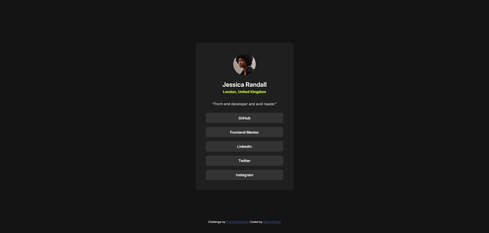

# Frontend Mentor - Social links profile solution

This is a solution to the [Social links profile challenge on Frontend Mentor](https://www.frontendmentor.io/challenges/social-links-profile-UG32l9m6dQ). Frontend Mentor challenges help you improve your coding skills by building realistic projects. 

## Table of contents

- [Overview](#overview)
  - [The challenge](#the-challenge)
  - [Screenshot](#screenshot)
  - [Links](#links)
- [My process](#my-process)
  - [Built with](#built-with)
- [Author](#author)

## Overview

I've decided to study the fullstack roadmap from the bottom up. For this challenge, I'm focusing solely on HTML and CSS. My main goals were practicing nesting and using CSS variables, while also applying a mobile-first workflow.

It was a relatively easy challenge, but completing it felt great. I'm looking forward to the next one!

### The challenge

Users should be able to:

- See hover and focus states for all interactive elements on the page

### Screenshot

### Links

- Live Site URL: [Github Pages](https://ropierre.github.io/frontend-mentor_Social-Links-Profile/)
- Solution URL: [Github](https://github.com/ROPierre/frontend-mentor_Social-Links-Profile)

## My process

### Built with

- Semantic HTML5 markup
- CSS custom properties
- Flexbox
- Mobile-first workflow

### Continued development

I will be improving this challange code using SCSS or SASS and, in the future, try to create a VueJS example using the concept of components.

## Author

- GitHub - [Rafael Pierre](https://github.com/ROPierre)
- Frontend Mentor - [@ROPierre](https://www.frontendmentor.io/profile/ROPierre)